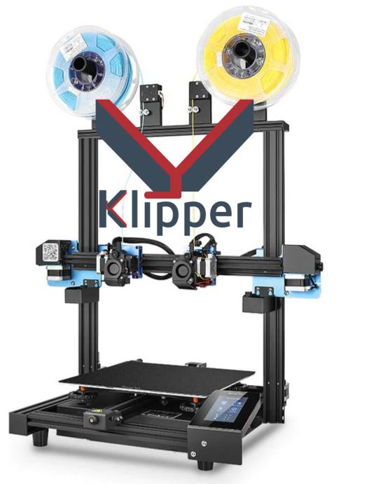

Pleas use the newest release for download "[Release](https://github.com/Bully85/Sovol-SV04-Klipper/releases)"

# Sovol-SV04-Klipper
This repository contains all the necessary configuration files for the SV04 to work with Klipper's Mirror and Copy modes, including images and descriptions.



# Spenden/Donations

[](https://www.paypal.com/donate/?hosted_button_id=L85ULXXQKALP6)

# _Für die deutsche Anleitung wählt bitte READMEdeutsch.md_

# new
Click here for the Discord https://discord.gg/8Svd9usX
# update
Attention, the configs have changed with the new update. Please re-insert IDEX_mode.cfg, macros.cfg and Start-End-Macro.cfg. If the display is needed, these are in the config/SV04-with-display folder. Otherwise, if the original klipper is installed, config/SV04-works-with-orign-klipper can also be used but without the orign display

Change the Startcode in the Slicer [Cura](Cura Profile/Startcode.md) [Prusa_Slicer](Prusaslicer Profile/Startcode.md)
# Introduction

Different configs are required for the STM and GD versions of the printer.
Both are included in the "printer.cfg" file and you just need to uncomment the correct one.
You can verify whether your chip is STM or GD by either opening your electric box and checking manually, or by navigating to 'Machine -> System Loads -> mcu' in Mainsail.

This guide will help you set up your SV04 with Klipper, including the COPY and MIRROR modes.


# In Progress

Cura 5.3 is currently not supported, but we are working on it.


# Features

- Copy Mode (supports different temperatures but does not support first layer settings for the right Extruder)
- Mirror Mode (supports different temperatures but does not support first layer settings for the right Extruder)
- Dual Mode
- Single Mode
- Bed Mesh Levelling
- Input Shaping
- Display Functionality
- And much more


# Requirements

- Raspberry Pi 3 or newer with WiFi
    - Pi Zero won't work 
    - Pi 2 may or may not work, not recommended
- Optional but recommended: Original 7" touch screen
- Optional: Camera
- SSH; For example:
    - Powershell and Windows Terminal have SSH built-in
    - alternatively Putty or another SSH program (https://putty.org/)
- SFTP or SCP; For example:
    - FileZilla (https://filezilla-project.org/)
    - WinScp (https://winscp.net)
- Pi Imager (https://www.raspberrypi.com/software/)
- The configuration files provided in this repository
- MicroSD Card for the Raspi (min 8GB, the complete install is ~5.5GB)
- SD Card to flash the SV04 (max 8GB, formatted in Fat32 4096)


# Installation via pre-made OS image

The operating system for the Raspberry Pi can be found in the "[image Raspberry PI 3_4](https://drive.google.com/drive/folders/1rZepxzwUR5QTXRXcv5EBYin_gFiMcKVD)" directory. 
This should be installed onto the MicroSD card using the [Raspberry Pi Imager](https://www.raspberrypi.com/software/). 
Make sure to adjust your WiFi settings before writing the image (you can find them by clicking on the cog wheel in the bottom right corner). 

The firmware.bin file in the "Firmware bin" directory should be placed on the (Full Size)SD card and flashed onto the printer with the original display unplugged (the original display is not needed at this stage as it will not function). 
The files from the "config" directory should now be transferred to the Raspberry Pi as described [below](#transferring-files), or directly in the Mainsail interface, which can be accessed by using the IP address or Hostname.
- the Hostname can be configured in the WiFi Settings in Pi Imager 
- the IP can be found in your router


# Installation on an Existing OS

## Without Kiauh

Coming soon.

## If you use Kiauh
Follow the [Kiauh](https://github.com/th33xitus/kiauh) instructions first, then come back.

- Log in to the Raspberry Pi [via SSH](#using-ssh) and enter the following command:
```sh 
sudo nano kiauh/klipper_repos.txt.example
```

- Add the following line at the end (see image below):
```sh 
https://github.com/Bully85/klipper
```


- Save the file with Ctrl+X -> Y. 
- Rename the file to remove ".example" from the file name and press Enter, then Y. 
- Run Kiauh with the command 
```sh 
./kiauh/kiauh.sh
```
- Select Settings [6] 
- Then [1] to set the custom Klipper repository
- Choose [4] "Bully85/klipper"
- Then confirm everything with [y].

Exit SSH


# Installation on a new OS 

Using the Raspi Imager, install Mainsail OS from 'Other specific-purpose OS' -> '3D printing' -> 'Mainsail OS'.
Then boot your Raspi, connect via SSH, and install [Kiauh](https://github.com/th33xitus/kiauh). 
Now follow the [instructions above](#if-you-use-kiauh) to overwrite the default Klipper install with this one.
Once done connect via SFTP/SCP, and transfer all the files from this repo's 'config' folder into 'printer_data/config/'.
Reboot the Raspi for good measure, and you're done.


# Using SSH

You can use SSH via a graphical interface as mentioned [above](#requirements), or via the Terminal.
If you choose something like putty, follow their instructions.
The Terminal is already installed and usually quicker.
- open the Windows Terminal (it's called Terminal, not the old CMD), or Powershell 
- connect by typing 'ssh username@hostname' and enter your password when prompted
    - username and hostname are the ones you set up [earlier](#installation-via-pre-made-os-image)
    - if you're installing onto an existing OS, I trust that you know the username and hostname/IP
- do what you need...
- to exit, press Ctrl+D


# Transferring Files 

Now, the files and folders from the "config" directory must be copied to your printer's directory on the Raspberry Pi. The default is "printer_data". 
If this is not the case for you, please adjust the paths in the config and .sh files. 

The easiest way to do this is via an SFTP or SCP Program, such as FileZilla or WinScp [mentioned above](#requirements)


# Fixing the Invalid Message in Mainsail

To fix the invalid message in Mainsail, SSH into Klipper and execute the following command:

```sh 
sudo nano ~/printer_data/systemd/moonraker.env
```


Append "-g"  to the end of the "MOONRAKER_ARGS" Line: 


Quit and save, then reboot. 

In Mainsail, click on 'invalid' and perform a soft repair. Your setup should now be ready!
